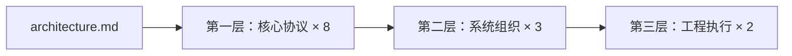

# Chronobar
> 为中国个人量化交易者而生 — 桌面优先，AI 受控，协议驱动

> 🚧 **当前状态：M1 协议定稿中**  
> 代码尚未开始，文档持续更新。Star 关注进展 →

## 平台简介

Chronobar 把量化交易从「脚本驱动的命令行工作台」变成「可靠的个人桌面平台」。
你不需要部署服务器，不需要维护脚本环境 — 打开即用，策略受控，数据可追溯。

**目标用户：** 个人量化交易者、个人量化用户、技术型交易者

**核心特性：**
- 桌面优先设计 - 原生桌面体验，非脚本驱动，降低使用门槛
- 原生 AI 插件支持 - 受控智能体增强决策，非自主操盘，符合监管要求
- 高性能 Tick 数据存储 - DuckDB + Parquet 双层架构，支持大规模历史数据
- 实时/回测/仿真统一接口 - 一套代码三种模式，保证一致性
- 前后端分离 - React + Python sidecar，前端可独立升级

**与同类工具对比：**

| 维度 | Chronobar | vnpy | WonderTrader |
|------|-----------|------|--------------|
| 部署形态 | 桌面 (Tauri) | Python 脚本 | 服务端 |
| 目标用户 | 个人量化 | 开发者/机构 | 机构/量化团队 |
| 前端技术 | React | Qt/Web | C++ |
| AI 插件支持 | 原生受控 | 第三方扩展 | 无 |
| 数据存储 | DuckDB + Parquet | SQLite | 自研 |
| 商业模式 | 开源核心 + 商业扩展 | 完全开源 | 商业授权 |
| 学习曲线 | 低（桌面优先） | 中（需 Python） | 高（需 C++） |
| Windows 支持 | ✅ 原生 | ✅ 跨平台 | ✅ 跨平台 |
| 策略语言 | Python | Python | C++ |
| 数据接入 | 国内主流期货 API（计划） | 50+ 交易所 | 国内期货 API |

## 快速上手（M1 预览）

> ⚠️ 当前为协议定稿阶段，M2 起提供可运行环境。

如果你想**理解 Chronobar 的核心设计**，推荐 5 分钟阅读路径：

1. [架构总览](docs/system/architecture.md) — 了解三层结构
2. [数据协议](docs/core/data_protocol.md) — 理解 Tick/Bar/Instrument 对象
3. [黄金样例](docs/core/golden_examples.md) — 看懂插件/策略的正确写法

**想第一时间收到 M2 可用通知？** → 点击页面右上角「Watch」按钮 或 [加入讨论](https://github.com/GeoFound/Chronobar/discussions)

---

## 文档地图

| 文档 | 核心职责 | 层级 | 状态 | 预计阅读 |
|------|---------|------|------|---------|
| [`docs/core/data_protocol.md`](docs/core/data_protocol.md) | 模块间数据交换（Tick、Bar、Instrument、AI 对象） | 第一层 | ✅ 已定稿 | 10 min |
| [`docs/core/event_protocol.md`](docs/core/event_protocol.md) | 模块间默认通信方式（EventEnvelope、订阅规则） | 第一层 | ✅ 已定稿 | 8 min |
| [`docs/core/gateway_protocol.md`](docs/core/gateway_protocol.md) | 网关接口标准化、连接状态管理、重连策略 | 第一层 | ✅ 已定稿 | 5 min |
| [`docs/core/plugin_protocol.md`](docs/core/plugin_protocol.md) | 扩展能力接入、权限控制、输出契约（5 层插件分类） | 第一层 | ✅ 已定稿 | 12 min |
| [`docs/core/ai_protocol.md`](docs/core/ai_protocol.md) | AI 插件协议、AI 数据对象、AI 风控检查 | 第一层 | ✅ 已定稿 | 8 min |
| [`docs/core/strategy_protocol.md`](docs/core/strategy_protocol.md) | 策略插件安全交易执行（Host API、权限模型） | 第一层 | ✅ 已定稿 | 10 min |
| [`docs/core/risk_protocol.md`](docs/core/risk_protocol.md) | 交易前风控检查（6 类风控检查、RiskChecker） | 第一层 | ✅ 已定稿 | 8 min |
| [`docs/core/backtest_protocol.md`](docs/core/backtest_protocol.md) | 回测/仿真/实盘统一接口（BacktestEngine、撮合模拟） | 第一层 | ✅ 已定稿 | 12 min |
| [`docs/system/architecture.md`](docs/system/architecture.md) | 系统分层、模块协作、依赖方向约束 | 第二层 | ✅ 已定稿 | 8 min |
| [`docs/system/config_protocol.md`](docs/system/config_protocol.md) | 系统配置组织、校验、迁移 | 第二层 | ✅ 已定稿 | 6 min |
| [`docs/system/ui_bridge_protocol.md`](docs/system/ui_bridge_protocol.md) | React 前端与 Python 核心协作（Query/Command/Subscription API） | 第二层 | ✅ 已定稿 | 8 min |
| [`docs/engineering/engineering_baseline.md`](docs/engineering/engineering_baseline.md) | 代码仓库组织、质量门槛、可交付标准 | 第三层 | ✅ 已定稿 | 10 min |
| [`docs/core/golden_examples.md`](docs/core/golden_examples.md) | 插件和策略正确实现（5 个黄金样例） | 第三层 | ✅ 已定稿 | 15 min |

**层级说明：**
- **第一层（核心协议层）**：定义系统最核心的交换边界
- **第二层（系统组织与接入层）**：定义模块如何组合、配置如何进入系统、前端如何访问核心
- **第三层（工程执行与落地层）**：把前两层文档变成真正可执行的工程规则

---

**阅读建议：**

---

## 按角色/任务快速索引

| 角色/任务 | 必读文档 | 参考文档 |
|----------|---------|---------|
| 🔧 新增核心功能 | [architecture.md](docs/system/architecture.md) · [data_protocol.md](docs/core/data_protocol.md) · [event_protocol.md](docs/core/event_protocol.md) | - |
| ⚙️ 新增配置项 | [config_protocol.md](docs/system/config_protocol.md) | - |
| 🧩 新增插件 | [plugin_protocol.md](docs/core/plugin_protocol.md) · [event_protocol.md](docs/core/event_protocol.md) · [data_protocol.md](docs/core/data_protocol.md) | [golden_examples.md](docs/core/golden_examples.md) · [engineering_baseline.md](docs/engineering/engineering_baseline.md) |
| 📊 新增策略 | [strategy_protocol.md](docs/core/strategy_protocol.md) · [risk_protocol.md](docs/core/risk_protocol.md) · [backtest_protocol.md](docs/core/backtest_protocol.md) · [data_protocol.md](docs/core/data_protocol.md) · [event_protocol.md](docs/core/event_protocol.md) | [golden_examples.md](docs/core/golden_examples.md) |
| 🛡️ 新增风控规则 | [risk_protocol.md](docs/core/risk_protocol.md) | - |
| 📈 做回测 | [backtest_protocol.md](docs/core/backtest_protocol.md) | - |
| 🎨 改前端体验 | [architecture.md](docs/system/architecture.md) · [event_protocol.md](docs/core/event_protocol.md) · [config_protocol.md](docs/system/config_protocol.md) · [ui_bridge_protocol.md](docs/system/ui_bridge_protocol.md) | - |
| ✅ 落代码和提测 | [engineering_baseline.md](docs/engineering/engineering_baseline.md) | - |
| 👨‍💻 前端开发 | [architecture.md](docs/system/architecture.md) · [event_protocol.md](docs/core/event_protocol.md) · [config_protocol.md](docs/system/config_protocol.md) · [ui_bridge_protocol.md](docs/system/ui_bridge_protocol.md) | - |
| ⚡ 核心计算 | [architecture.md](docs/system/architecture.md) · [data_protocol.md](docs/core/data_protocol.md) · [event_protocol.md](docs/core/event_protocol.md) · [engineering_baseline.md](docs/engineering/engineering_baseline.md) | - |
| 🔌 插件体系 | [plugin_protocol.md](docs/core/plugin_protocol.md) · [event_protocol.md](docs/core/event_protocol.md) · [data_protocol.md](docs/core/data_protocol.md) · [engineering_baseline.md](docs/engineering/engineering_baseline.md) | [golden_examples.md](docs/core/golden_examples.md) |
| 💰 策略交易 | [strategy_protocol.md](docs/core/strategy_protocol.md) · [risk_protocol.md](docs/core/risk_protocol.md) · [backtest_protocol.md](docs/core/backtest_protocol.md) · [data_protocol.md](docs/core/data_protocol.md) · [event_protocol.md](docs/core/event_protocol.md) | [golden_examples.md](docs/core/golden_examples.md) |
| 🚀 整体推进 | 全部 13 份文档 | 本 README 作为总索引 |

---

## 核心共识

| ✅ 我们这样做 | ❌ 我们不这样做 |
|---|---|
| 优先依赖正式协议 | 依赖口头约定 |
| 默认通过事件总线协作 | 跨层直连模块 |
| 展示层只消费标准结果 | 直接依赖网关私有字段 |
| 插件是受控扩展单元 | 任意脚本入口 |
| AI 插件通过 HostAPI 与核心交互 | AI 插件绕过风控直接操盘 |
| 配置必须可迁移、回放可复验、日志可追踪 | 配置写死、回放不可复现 |
| React 前端体验可以持续升级 | 反向污染核心边界 |

---

## 贡献指南

Chronobar 欢迎社区贡献。详见 [`docs/CONTRIBUTING.md`](docs/CONTRIBUTING.md) 了解开发流程、阶段规划和工程标准。

## 许可证

本项目采用 MIT 许可证。详见 [LICENSE](LICENSE) 文件。

**反馈与讨论：** [GitHub Issues](https://github.com/GeoFound/Chronobar/issues)