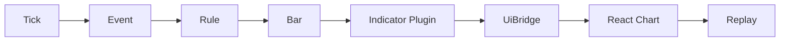
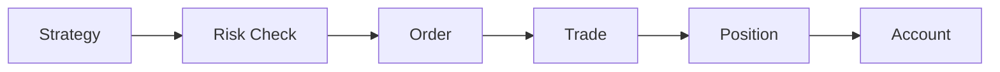

# Chronobar
> 面向中国期货市场的个人量化桌面平台

## 平台简介

Chronobar 是面向个人量化用户和个人交易用户的期货量化桌面平台，采用"开源核心 + 商业扩展"的双层模式。与 vnpy、WonderTrader 不同，Chronobar 专注于桌面端体验，使用 Tauri + React + Python sidecar 架构，提供原生受控的 AI 插件支持和 DuckDB + Parquet 双层存储架构。

**核心特性：**
- 桌面优先设计，非脚本驱动
- 原生 AI 插件支持（受控智能体，非自主决策）
- 高性能 Tick 数据存储（DuckDB + Parquet）
- 实时/回测/仿真统一接口
- 前后端分离（React + Python sidecar）

**目标用户：** 个人量化交易者、个人量化用户、技术型交易者

**与同类工具对比：**

| 维度 | Chronobar | vnpy | WonderTrader |
|------|-----------|------|--------------|
| 部署形态 | 桌面 (Tauri) | Python 脚本 | 服务端 |
| 目标用户 | 个人量化 | 开发者/机构 | 机构/量化团队 |
| 前端技术 | React | Qt/Web | C++ |
| AI 插件支持 | 原生受控 | 第三方扩展 | 无 |

## 当前状态

**M1 协议定稿阶段**

本仓库当前处于 M1 协议定稿阶段，仅包含文档（docs/）和配置文件，尚未创建代码目录（core/、gateways/、compute/ 等）。代码目录将在 M2 阶段按 [`docs/engineering/engineering_baseline.md`](docs/engineering/engineering_baseline.md) 规定的结构创建。

**路线图：**
- M1: 协议定稿（当前）
- M2: 核心框架搭建
- M3: 插件系统实现
- M4: 回测系统实现
- M5: 前端界面完善

---

## 文档地图

| 文档 | 解决问题 | 所属层级 | 层级说明 |
|------|---------|---------|---------|
| [`docs/core/data_protocol.md`](docs/core/data_protocol.md) | 模块间数据交换（Tick、Bar、Instrument、AI 对象） | 第一层 | 定义系统通用标准对象和交易执行数据对象 |
| [`docs/core/event_protocol.md`](docs/core/event_protocol.md) | 模块间默认通信方式（EventEnvelope、订阅规则） | 第一层 | 定义系统默认协作总线（包含交易执行事件） |
| [`docs/core/gateway_protocol.md`](docs/core/gateway_protocol.md) | 网关接口标准化、连接状态管理、重连策略 | 第一层 | 网关接口标准化、连接状态管理、重连策略 |
| [`docs/core/plugin_protocol.md`](docs/core/plugin_protocol.md) | 扩展能力接入、权限控制、输出契约（5 层插件分类） | 第一层 | 定义扩展能力接入方式（5 层插件分类） |
| [`docs/core/ai_protocol.md`](docs/core/ai_protocol.md) | AI 插件协议、AI 数据对象、AI 风控检查 | 第一层 | 定义 AI 插件接口、AI 数据对象和 AI 风控检查 |
| [`docs/core/strategy_protocol.md`](docs/core/strategy_protocol.md) | 策略插件安全交易执行（Host API、权限模型） | 第一层 | 定义策略插件接口和 Host API |
| [`docs/core/risk_protocol.md`](docs/core/risk_protocol.md) | 交易前风控检查（6 类风控检查、RiskChecker） | 第一层 | 定义风控检查接口和事件模型 |
| [`docs/core/backtest_protocol.md`](docs/core/backtest_protocol.md) | 回测/仿真/实盘统一接口（BacktestEngine、撮合模拟） | 第一层 | 定义回测、仿真、实盘统一接口 |
| [`docs/system/architecture.md`](docs/system/architecture.md) | 系统分层、模块协作、依赖方向约束 | 第二层 | 规定系统分层、依赖方向、主流程（依赖第一层所有文档） |
| [`docs/system/config_protocol.md`](docs/system/config_protocol.md) | 系统配置组织、校验、迁移 | 第二层 | 定义系统配置输入、校验与迁移规则 |
| [`docs/system/ui_bridge_protocol.md`](docs/system/ui_bridge_protocol.md) | React 前端与 Python 核心协作（Query/Command/Subscription API） | 第二层 | 定义 React 展示层与 Python 核心的交互边界 |
| [`docs/engineering/engineering_baseline.md`](docs/engineering/engineering_baseline.md) | 代码仓库组织、质量门槛、可交付标准 | 第三层 | 把以上所有文档转化为仓库结构、测试门槛与交付标准 |
| [`docs/core/golden_examples.md`](docs/core/golden_examples.md) | 插件和策略正确实现（5 个黄金样例） | 第三层 | 提供参考实现样例（MA 指标、双均线信号、策略、AI 情感信号、测试） |

**层级说明：**
- **第一层（核心协议层）**：定义系统最核心的交换边界。如果这层不稳定，计算链路、回放链路、插件链路、策略链路和风控链路都会反复返工。
- **第二层（系统组织与接入层）**：定义模块如何组合、配置如何进入系统、前端如何访问核心。它们建立的是"系统运行方式"，而不是某个具体功能的实现细节。
- **第三层（工程执行与落地层）**：把前两层文档变成真正可执行的工程规则。它决定仓库怎么搭、测试怎么补、类型怎么检查、交付怎么验收，并提供参考实现。

---

## 推荐阅读顺序

如果你是第一次接手这个项目，建议按下面顺序阅读：

1. [`docs/system/architecture.md`](docs/system/architecture.md) - 整体骨架、系统分层、主流程
2. [`docs/core/data_protocol.md`](docs/core/data_protocol.md) - 标准对象
3. [`docs/core/event_protocol.md`](docs/core/event_protocol.md) - 事件模型
4. [`docs/core/gateway_protocol.md`](docs/core/gateway_protocol.md) - 网关接口定义
5. [`docs/core/plugin_protocol.md`](docs/core/plugin_protocol.md) - 扩展能力接入
6. [`docs/core/ai_protocol.md`](docs/core/ai_protocol.md) - AI 插件协议
7. [`docs/core/strategy_protocol.md`](docs/core/strategy_protocol.md) - 策略交易
8. [`docs/core/risk_protocol.md`](docs/core/risk_protocol.md) - 风控检查
9. [`docs/core/backtest_protocol.md`](docs/core/backtest_protocol.md) - 回测/仿真/实盘
10. [`docs/system/config_protocol.md`](docs/system/config_protocol.md) - 配置管理
11. [`docs/system/ui_bridge_protocol.md`](docs/system/ui_bridge_protocol.md) - 前后端边界
12. [`docs/core/golden_examples.md`](docs/core/golden_examples.md) - 黄金样例
13. [`docs/engineering/engineering_baseline.md`](docs/engineering/engineering_baseline.md) - 工程约束

---

## 按角色/任务快速索引

🔧 新增核心功能

必读：[`docs/system/architecture.md`](docs/system/architecture.md) · [`docs/core/data_protocol.md`](docs/core/data_protocol.md) · [`docs/core/event_protocol.md`](docs/core/event_protocol.md)

⚙️ 新增配置项

必读：[`docs/system/config_protocol.md`](docs/system/config_protocol.md)

🧩 新增插件

必读：[`docs/core/plugin_protocol.md`](docs/core/plugin_protocol.md) · [`docs/core/event_protocol.md`](docs/core/event_protocol.md) · [`docs/core/data_protocol.md`](docs/core/data_protocol.md)

参考：[`docs/core/golden_examples.md`](docs/core/golden_examples.md) · [`docs/engineering/engineering_baseline.md`](docs/engineering/engineering_baseline.md)

📊 新增策略

必读：[`docs/core/strategy_protocol.md`](docs/core/strategy_protocol.md) · [`docs/core/risk_protocol.md`](docs/core/risk_protocol.md) · [`docs/core/backtest_protocol.md`](docs/core/backtest_protocol.md) · [`docs/core/data_protocol.md`](docs/core/data_protocol.md) · [`docs/core/event_protocol.md`](docs/core/event_protocol.md)

参考：[`docs/core/golden_examples.md`](docs/core/golden_examples.md)

🛡️ 新增风控规则

必读：[`docs/core/risk_protocol.md`](docs/core/risk_protocol.md)

📈 做回测

必读：[`docs/core/backtest_protocol.md`](docs/core/backtest_protocol.md)

🎨 改前端体验

必读：[`docs/system/architecture.md`](docs/system/architecture.md) · [`docs/core/event_protocol.md`](docs/core/event_protocol.md) · [`docs/system/config_protocol.md`](docs/system/config_protocol.md) · [`docs/system/ui_bridge_protocol.md`](docs/system/ui_bridge_protocol.md)

✅ 落代码和提测

必读：[`docs/engineering/engineering_baseline.md`](docs/engineering/engineering_baseline.md)

👨‍💻 前端开发

必读：[`docs/system/architecture.md`](docs/system/architecture.md) · [`docs/core/event_protocol.md`](docs/core/event_protocol.md) · [`docs/system/config_protocol.md`](docs/system/config_protocol.md) · [`docs/system/ui_bridge_protocol.md`](docs/system/ui_bridge_protocol.md)

⚡ 核心计算

必读：[`docs/system/architecture.md`](docs/system/architecture.md) · [`docs/core/data_protocol.md`](docs/core/data_protocol.md) · [`docs/core/event_protocol.md`](docs/core/event_protocol.md) · [`docs/engineering/engineering_baseline.md`](docs/engineering/engineering_baseline.md)

🔌 插件体系

必读：[`docs/core/plugin_protocol.md`](docs/core/plugin_protocol.md) · [`docs/core/event_protocol.md`](docs/core/event_protocol.md) · [`docs/core/data_protocol.md`](docs/core/data_protocol.md) · [`docs/engineering/engineering_baseline.md`](docs/engineering/engineering_baseline.md)

参考：[`docs/core/golden_examples.md`](docs/core/golden_examples.md)

💰 策略交易

必读：[`docs/core/strategy_protocol.md`](docs/core/strategy_protocol.md) · [`docs/core/risk_protocol.md`](docs/core/risk_protocol.md) · [`docs/core/backtest_protocol.md`](docs/core/backtest_protocol.md) · [`docs/core/data_protocol.md`](docs/core/data_protocol.md) · [`docs/core/event_protocol.md`](docs/core/event_protocol.md)

参考：[`docs/core/golden_examples.md`](docs/core/golden_examples.md)

🚀 整体推进

必读：全部 12 份文档

参考：本 README 作为总索引

---

## 核心共识

> - 平台优先依赖正式协议，不依赖口头约定
> - 默认协作通道是事件总线，不是跨层直连
> - 展示层只消费标准结果，不直接依赖网关私有字段
> - 插件是受控扩展单元，不是任意脚本入口
> - AI 插件是受控智能体，不是自主决策单元，必须通过 HostAPI 与核心交互，不能绕过风控直接操盘
> - 配置必须可迁移，回放必须可复验，日志必须可追踪
> - React 前端体验可以持续升级，但不能反向污染核心边界

---

## 第一阶段最小落地建议

M1 阶段（协议定稿）的具体实施顺序如下：

1. 先定稿核心协议：[`docs/core/data_protocol.md`](docs/core/data_protocol.md)、[`docs/core/event_protocol.md`](docs/core/event_protocol.md)、[`docs/core/plugin_protocol.md`](docs/core/plugin_protocol.md)
2. 再定稿系统组织：[`docs/system/architecture.md`](docs/system/architecture.md)、[`docs/system/config_protocol.md`](docs/system/config_protocol.md)、[`docs/system/ui_bridge_protocol.md`](docs/system/ui_bridge_protocol.md)
3. 补充定稿交易协议：[`docs/core/strategy_protocol.md`](docs/core/strategy_protocol.md)、[`docs/core/risk_protocol.md`](docs/core/risk_protocol.md)、[`docs/core/backtest_protocol.md`](docs/core/backtest_protocol.md)
4. 最后按 [`docs/engineering/engineering_baseline.md`](docs/engineering/engineering_baseline.md) 搭仓库、补 schema、补测试、建最小闭环
5. 参考 [`docs/core/golden_examples.md`](docs/core/golden_examples.md) 实现第一版插件和策略

第一阶段的目标不是把所有界面都做漂亮，而是先跑通这条主链路：

以及这条交易链路：

只要这两条链路跑通，并且回放与实时结果一致，这个平台就具备第一版架构骨架。

---

## 维护原则

本 README 不是详细协议文档，不承载字段级定义，也不替代正式协议。
它只负责回答一个问题：**当你面对整套架构文档时，应该先看什么、每份文档负责什么、它们之间怎么协作。**

当任何正式协议发生结构变化时，本 README 也必须同步更新。

---

## 贡献指南

Chronobar 欢迎社区贡献。在提交 Pull Request 前，请确保：

1. 代码符合 [`docs/engineering/engineering_baseline.md`](docs/engineering/engineering_baseline.md) 规定的工程标准
2. 通过所有测试用例
3. 更新相关文档（如有必要）
4. 提交信息清晰描述变更内容

## 许可证

本项目采用 MIT 许可证。详见 [LICENSE](LICENSE) 文件。

---

## 联系方式

- GitHub Issues: https://github.com/GeoFound/Chronobar/issues
- 文档: [`docs/`](docs/)