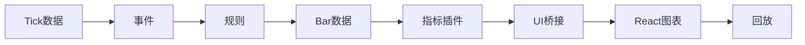
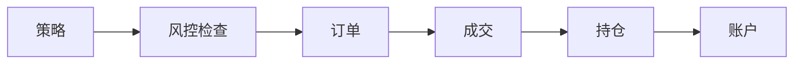

# Chronobar 贡献指南

本文档面向项目贡献者和协作者，说明开发流程、阶段规划和维护原则。

## 阶段规划

### M1 阶段：协议定稿（当前）

本仓库当前处于 M1 协议定稿阶段，仅包含文档（docs/）和配置文件，尚未创建代码目录（core/、gateways/、compute/ 等）。

### 第一阶段最小落地建议

M1 阶段（协议定稿）的具体实施顺序如下：

1. 先定稿核心协议：[`docs/core/data_protocol.md`](core/data_protocol.md)、[`docs/core/event_protocol.md`](core/event_protocol.md)、[`docs/core/plugin_protocol.md`](core/plugin_protocol.md)
2. 再定稿系统组织：[`docs/system/architecture.md`](system/architecture.md)、[`docs/system/config_protocol.md`](system/config_protocol.md)、[`docs/system/ui_bridge_protocol.md`](system/ui_bridge_protocol.md)
3. 补充定稿交易协议：[`docs/core/strategy_protocol.md`](core/strategy_protocol.md)、[`docs/core/risk_protocol.md`](core/risk_protocol.md)、[`docs/core/backtest_protocol.md`](core/backtest_protocol.md)
4. 最后按 [`docs/engineering/engineering_baseline.md`](engineering/engineering_baseline.md) 搭仓库、补 schema、补测试、建最小闭环
5. 参考 [`docs/core/golden_examples.md`](core/golden_examples.md) 实现第一版插件和策略

第一阶段的目标不是把所有界面都做漂亮，而是先跑通这条主链路：

以及这条交易链路：

只要这两条链路跑通，并且回放与实时结果一致，这个平台就具备第一版架构骨架。

### 后续阶段

- M2: 核心框架搭建
- M3: 插件系统实现
- M4: 回测系统实现
- M5: 前端界面完善

## 开发流程

### PR 流程规范

详见 [`docs/engineering/engineering_baseline.md`](engineering/engineering_baseline.md) §9（PR 流程规范）。

**核心要求：**
- 禁止直接 push 到 main 分支
- 所有代码变更必须通过 Pull Request 流程
- 遵循 Conventional Commits 格式
- 至少一名 Reviewer 批准方可合并

### 工程标准

详见 [`docs/engineering/engineering_baseline.md`](engineering/engineering_baseline.md)。

**核心要求：**
- 核心模块必须全量类型标注
- 测试覆盖率：核心模块 ≥80%，协议层 ≥95%
- 禁止无约束 `dict` 作为长期数据边界
- AI 生成代码必须通过声明模板验证

## 维护原则

### README 维护

README 不是详细协议文档，不承载字段级定义，也不替代正式协议。
它只负责回答一个问题：**当你面对整套架构文档时，应该先看什么、每份文档负责什么、它们之间怎么协作。**

当任何正式协议发生结构变化时，README 也必须同步更新。

### 协议文档维护

- 协议文档变更必须同步更新相关文档
- 修改 schema 必须同步更新示例文件
- 修改字段含义必须补 migration
- 所有迁移必须附测试样例

## 贡献清单

在提交 Pull Request 前，请确保：

1. 代码符合 [`docs/engineering/engineering_baseline.md`](engineering/engineering_baseline.md) 规定的工程标准
2. 通过所有测试用例
3. 更新相关文档（如有必要）
4. 提交信息清晰描述变更内容
5. 使用 PR 模板填写变更描述

## 许可证

本项目采用 MIT 许可证。详见 [LICENSE](../../LICENSE) 文件。
